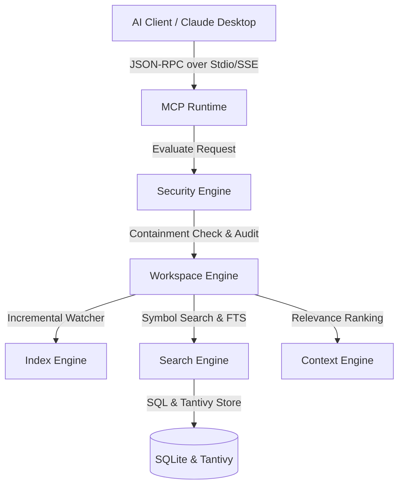

# 🌌 WorkspaceOS: Universal AI Workspace Runtime

[](#)
[](#)
[](#)

WorkspaceOS is a high-performance local runtime that enables modern AI assistants (Grok, ChatGPT, Claude, Gemini, Qwen, DeepSeek) to securely understand, navigate, analyze, and modify local software projects with complete context, absolute security sandbox containment, and low resource overhead.

> [!NOTE]
> WorkspaceOS is not an AI model. It is the intelligence and security layer between AI clients and your local development environment.

---

## 🚀 Key Value Propositions

- **Context Before Tokens**: Instead of feeding thousands of lines of raw code to LLMs, WorkspaceOS calculates relevance-ranked AST code snippets dynamically based on intent, saving API costs and increasing accuracy.
- **Strict Security Sandbox**: Prevents AI tools from traversing directory paths outside the defined workspace boundary. All operations (read, write, search) are audited and restricted.
- **High-Performance FTS**: Powered by Tantivy and Tree-sitter for instantaneous full-text searches, path matching, and symbol resolution without heavy disk scanning.
- **Provider Agnostic**: Exposes capabilities via the standard Model Context Protocol (MCP) to integrate with any client natively.

---

## 🏗️ System Architecture



---

## 🛠️ Technology Stack

- **Core Engine**: Rust
- **Desktop Dashboard**: Tauri v2 & React 19
- **Database**: SQLite (persisting symbols & files) + Tantivy (FTS indices)
- **Watcher**: Notify (cross-platform debounced fs-watcher)
- **Parsing**: Tree-sitter AST parser
- **IPC Protocol**: Tauri Event Bridge & command invoking
- **MCP Server**: Stdio / JSON-RPC 2.0 router

---

## 📂 Repository Structure

- `apps/desktop/`: React frontend and Tauri desktop client shell.
- `crates/workspace-engine/`: Handles workspace registrations, configurations, and watcher events.
- `crates/index-engine/`: Extracts syntax symbols (functions, structs) using tree-sitter.
- `crates/search-engine/`: SQLite and Tantivy Full-Text Search.
- `crates/context-engine/`: Detects intent and ranks snippet relevance.
- `crates/security-engine/`: Validates path containment and writes append-only audit logs.
- `crates/mcp-runtime/`: Exposes standard MCP tools to AI clients.
- `crates/tunnel-manager/`: Coordinates ngrok and Cloudflare secure remote tunnels.
- `crates/plugin-system/`: Dynamically preloads companion plugins and loads external manifests.
- `crates/e2e-tests/`: Full integration testing suite.

---

## 🏁 Getting Started

### 📋 Prerequisites
- **Node.js**: v18+ (with `pnpm` package manager)
- **Rust**: stable edition (with `cargo`)

### 🔧 Installation
1. Install node dependencies:
   ```powershell
   pnpm install
   ```

2. Build and verify the suite:
   ```powershell
   pnpm build
   ```

---

## 💻 Development Commands

The workspace is managed through unified package scripts:

| Command | Action |
|:---|:---|
| `pnpm dev` | Run the Tauri developer environment (interactive hot reloading desktop client). |
| `pnpm dev:web` | Run the React dashboard preview in browser mode. |
| `pnpm build` | Compile the React web application bundle and the Rust binaries. |
| `pnpm lint` | Run eslint on the frontend and clippy on the backend targets. |
| `pnpm format` | Run code formatter on all TypeScript, CSS, and Rust codebases. |
| `pnpm test` | Run the entire unit testing and E2E integration test suite. |
| `pnpm test:unit` | Run all workspace unit tests (`cargo test --workspace`). |
| `pnpm test:e2e` | Run only the E2E lifecycle integration tests. |

---

## 🔌 Tunnel Configuration & Remote Sessions
WorkspaceOS supports dynamic tunnel configuration directly from the runtime dashboard:
1. **Choose a Tunnel Provider**: Select from **Cloudflare Tunnel**, **ngrok Tunnel**, or **Tailscale Funnel**.
2. **Apply Authentication**: Paste your secure auth token in the dashboard settings block to provision secure remote sessions.
3. **Copy endpoint URL**: Click the copy icon next to the generated URL to copy the remote MCP tunnel endpoint with a single click.

---

## 📦 Production Packaging
To build production installers:
```powershell
pnpm build:tauri
```
For more information, please read the [Release & Deployment Guide](file:///g:/Ahad/DesktopApps/WorkspaceOS/RELEASE-GUIDE.md).
