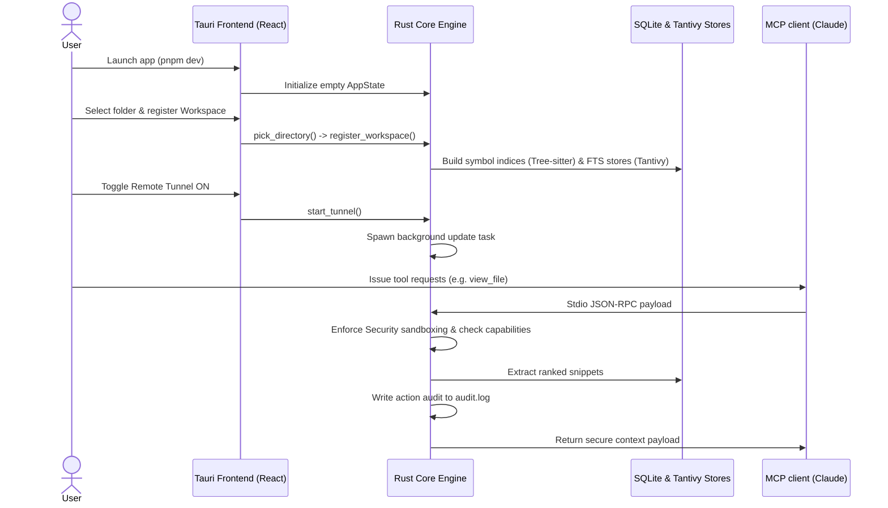

# 🔄 WorkspaceOS E2E Execution & Flow Guide

This document describes the step-by-step runtime lifecycle of WorkspaceOS, outlining user actions and backend behaviors.

---

## 📈 The WorkspaceOS Runtime Lifecycle



---

## 🛠️ Execution Flow Instructions

### Step 1: Initialize Development Servers
1. Open your terminal in the repository root.
2. Launch the dev servers:
   ```powershell
   pnpm dev
   ```
   *This starts the Vite React frontend on port `1420` and loads the native Tauri shell.*

---

### Step 2: Register & Activate Workspaces
1. Navigate to the **Workspaces** tab on the left-side menu.
2. Click **"Register Workspace"**.
3. Click the **"Browse..."** button. A native directory dialog will open.
4. Select your project directory and click **"Open"**.
   - *WorkspaceOS will automatically populate the workspace name using the folder's name.*
5. Click **"Register"** to add it to the active registry.
6. Click **"Activate"** next to your workspace in the table.
   - **Backend Action**: The Rust core initializes aNotify filesystem watcher, executes Tree-sitter AST parsing for all source code files, and registers search vectors in Tantivy.

---

### Step 3: Customize Capabilities & Profiles
1. Open the **Settings** tab.
2. Under **Performance Profile**, choose low, mid, high, or ultra options depending on your system RAM allocation.
3. Under **Security Enforcement**, toggle capability switches (e.g., Allow/Disallow Write Files, Allow/Disallow Shell Executions) to fine-tune what tools AI clients can access.
   - **Backend Action**: Changes are written instantly to `.workspaceos.toml` in your project root.

---

### Step 4: Expose Secure Tunnels
1. Open the **Dashboard** tab.
2. Toggle **"Remote Tunnel"** to **ON**.
   - **Backend Action**: The tunnel manager starts the background process and gathers latency/packet stats, feeding them back to the frontend in real time.
3. Copy the public connection endpoint.

---

### Step 5: Connect your AI Client (MCP)
1. Copy the configuration payload under the **MCP Server** tab.
2. Paste it inside your Claude Desktop configuration file (located at `%APPDATA%\Claude\claude_desktop_config.json`).
3. Launch Claude Desktop. It connects via stdio and queries available tools.

---

### Step 6: Monitor real-time logs
1. Open the **Logs** tab on the Dashboard.
2. Every action taken by the AI is parsed by the **Security Engine** to check path containment boundaries.
3. Actions (e.g., `AUDIT_OK` or `AUDIT_FAIL`) are rendered in real time.
